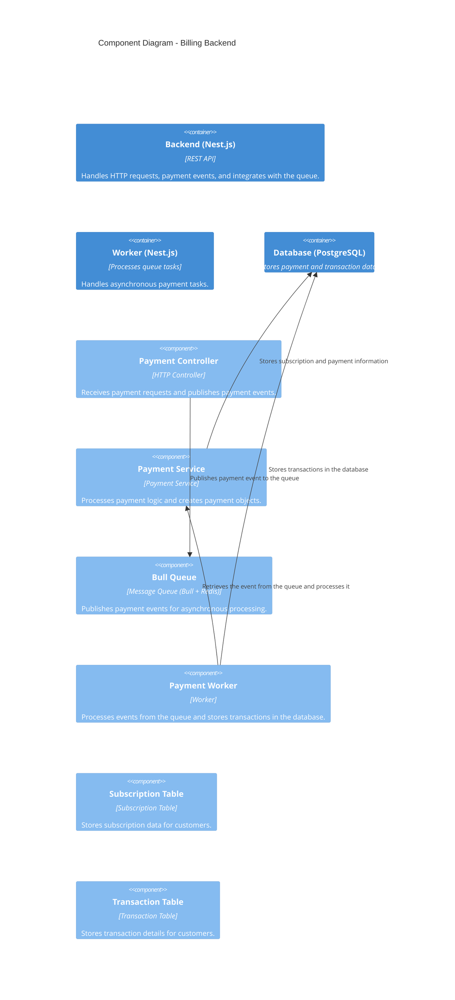

```mermaid
C4Component
    title Component Diagram - Billing Backend

    Container(web-server, "Backend (Nest.js)", "REST API", "Handles HTTP requests, payment events, and integrates with the queue.")
    Container(worker, "Worker (Nest.js)", "Processes queue tasks", "Handles asynchronous payment tasks.")
    Container(database, "Database (PostgreSQL)", "Stores payment and transaction data.")

    Component(payment-controller, "Payment Controller", "HTTP Controller", "Receives payment requests and publishes payment events.")
    Component(payment-service, "Payment Service", "Payment Service", "Processes payment logic and creates payment objects.")
    Component(bull-queue, "Bull Queue", "Message Queue (Bull + Redis)", "Publishes payment events for asynchronous processing.")
    Component(payment-worker, "Payment Worker", "Worker", "Processes events from the queue and stores transactions in the database.")
    Component(subscription, "Subscription Table", "Subscription Table", "Stores subscription data for customers.")
    Component(transaction, "Transaction Table", "Transaction Table", "Stores transaction details for customers.")

    Rel(payment-controller, bull-queue, "Publishes payment event to the queue")
    Rel(payment-worker, payment-service, "Retrieves the event from the queue and processes it")
    Rel(payment-worker, database, "Stores transactions in the database")
    Rel(payment-service, database, "Stores subscription and payment information")
```
