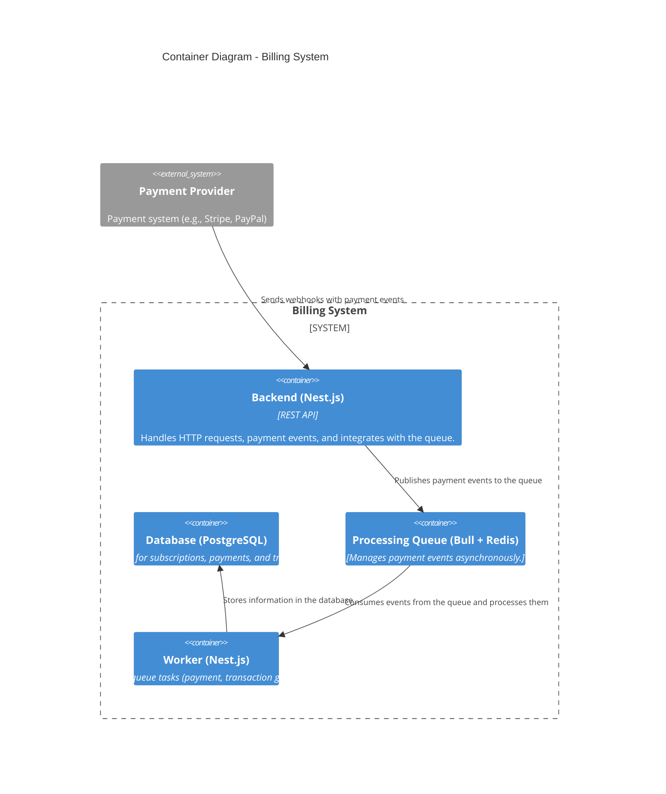

```mermaid
C4Container
title Container Diagram - Billing System

    System_Boundary(billing-system, "Billing System") {
        Container(web-server, "Backend (Nest.js)", "REST API", "Handles HTTP requests, payment events, and integrates with the queue.")
        Container(database, "Database (PostgreSQL)", "Stores data for subscriptions, payments, and transactions.")
        Container(queue, "Processing Queue (Bull + Redis)", "Manages payment events asynchronously.")
        Container(worker, "Worker (Nest.js)", "Processes queue tasks (payment, transaction generation).")
    }

    System_Ext(external-system, "Payment Provider", "Payment system (e.g., Stripe, PayPal)")

    Rel(web-server, queue, "Publishes payment events to the queue")
    Rel(queue, worker, "Consumes events from the queue and processes them")
    Rel(worker, database, "Stores information in the database")
    Rel(external-system, web-server, "Sends webhooks with payment events")
```
