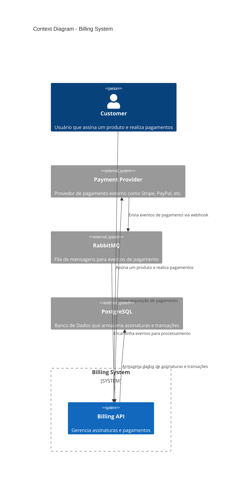

```mermaid
C4Context
title Context Diagram - Billing System

Person(Customer, "Customer", "Usuário que assina um produto e realiza pagamentos")

System_Boundary(BillingSystem, "Billing System") {
    System(BillingAPI, "Billing API", "Gerencia assinaturas e pagamentos")
}

System_Ext(PaymentProvider, "Payment Provider", "Provedor de pagamento externo como Stripe, PayPal, etc.")
System_Ext(RabbitMQ, "RabbitMQ", "Fila de mensagens para eventos de pagamento")
System_Ext(Database, "PostgreSQL", "Banco de Dados que armazena assinaturas e transações")

Rel(Customer, BillingAPI, "Assina um produto e realiza pagamentos")
Rel(BillingAPI, PaymentProvider, "Envia requisição de pagamento")
Rel(PaymentProvider, RabbitMQ, "Envia eventos de pagamento via webhook")
Rel(RabbitMQ, BillingAPI, "Encaminha eventos para processamento")
Rel(BillingAPI, Database, "Armazena dados de assinaturas e transações")
```
