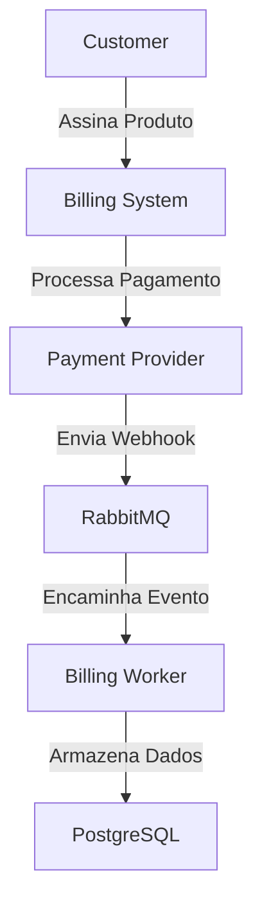

## Context Diagram

```mermaid
graph TD;
  customer[Customer] -->|Assina Produto| billing_system[Billing System];
  billing_system -->|Processa Pagamento| payment_provider[Payment Provider];
  payment_provider -->|Envia Webhook| rabbitmq[RabbitMQ];
  rabbitmq -->|Encaminha Evento| worker[Billing Worker];
  worker -->|Armazena Dados| postgresql[PostgreSQL];
```
